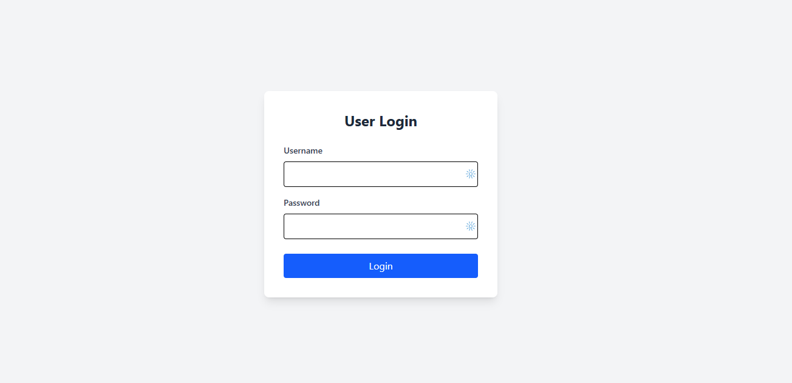
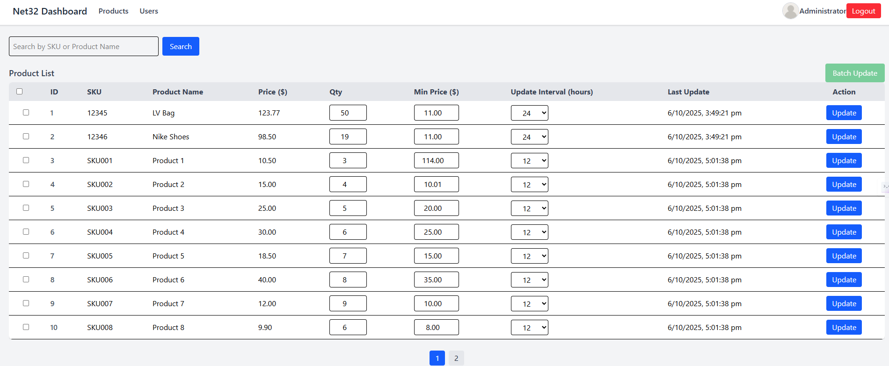
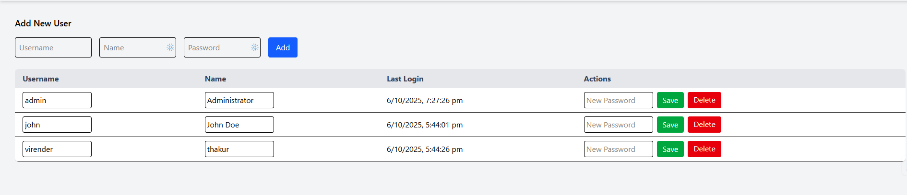

# Creative Media Dashboard

A simple 3-page full-stack web app built with **Node.js**, **Express**, **EJS**, **MySQL**, and **TailwindCSS**.

---

## 📋 Features
- Login with username/password (no email validation)
- Product Management:
  - Pagination, Search, Update fields (Qty, Min Price, Update Interval)
  - Toast notifications and top loading progress bar
- User Management: Standard CRUD (username, name, password, last login)
- TailwindCSS-based modern UI

---

## 🧱 Tech Stack
| Layer | Technology |
|-------|-------------|
| **Frontend** | EJS + TailwindCSS |
| **Backend** | Node.js + Express |
| **Database** | MySQL | 
| **Styling** | TailwindCSS |

---

## 🚀 Setup Instructions

### 1. Clone the repository
```bash
git clone https://github.com/iam-viru/CreativeMediaApp.git
cd CreativeMediaApp
```

### 2. Install dependencies
```bash
npm install
```

### 3. Create `.env` file
```env
DB_HOST=localhost
DB_USER=root
DB_PASSWORD=yourpassword
DB_NAME=creative_media
SESSION_SECRET=secret123
PORT=3000
```

### 4. Set up the database
Run this SQL in MySQL Workbench:
```sql
CREATE DATABASE creative_media;
USE creative_media;

CREATE TABLE users (
  id INT AUTO_INCREMENT PRIMARY KEY,
  username VARCHAR(50),
  name VARCHAR(100),
  password VARCHAR(255),
  last_login DATETIME
);

CREATE TABLE products (
  id INT AUTO_INCREMENT PRIMARY KEY,
  sku VARCHAR(50),
  product_name VARCHAR(255),
  price DECIMAL(10,2),
  qty INT,
  minimum_price DECIMAL(10,2),
  update_interval VARCHAR(20),
  last_update DATETIME DEFAULT CURRENT_TIMESTAMP
);
```

### 5. Run the app
```bash
node server.js
```

Access at: [http://localhost:3000](http://localhost:3000)

---

## 🌐 Deployment Instructions

1. Install Node.js, npm, and MySQL on the server.
2. Create the database and import the tables.
3. Copy the project files to the server.
4. Configure `.env` with actual DB credentials.
5. Run the app:
   ```bash
   npm install
   node server.js
   ```
6. Open `http://SERVER-IP:3000` in browser.

Optional (for production): use `pm2` to keep the app running
```bash
npm install -g pm2
pm2 start server.js --name CreativeMediaApp
pm2 save
pm2 startup
```

---

## 📸 Screenshot




---

## 👨‍💻 Author
**Virender Thakur** — Full-Stack Developer  
🔗 [Upwork Profile](https://www.upwork.com/freelancers/iamviru)
